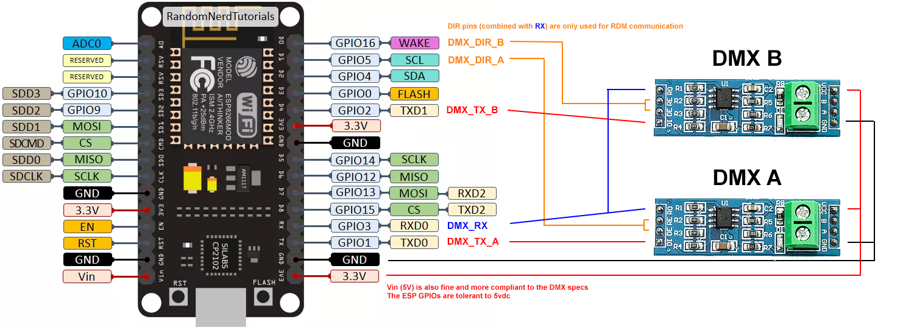
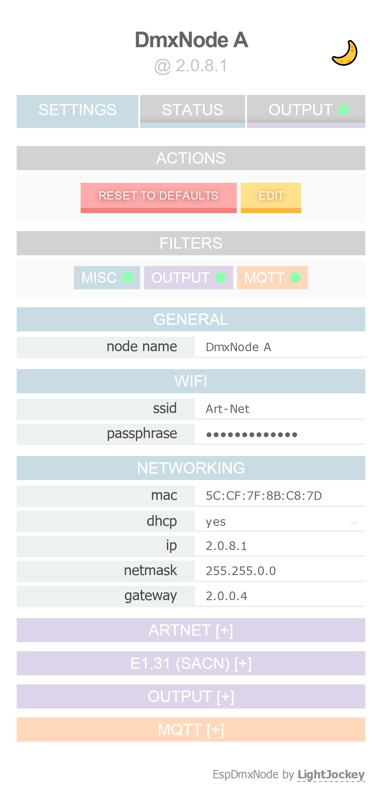
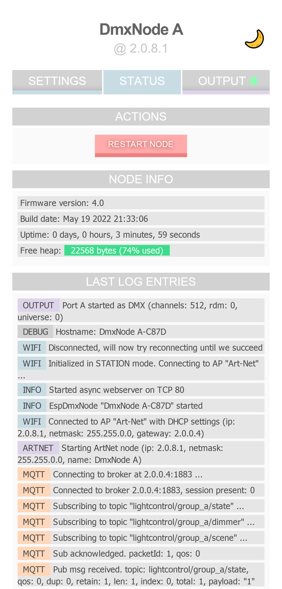
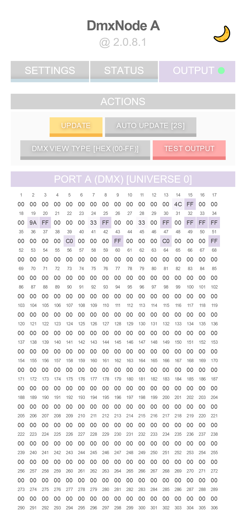

# EspDmxNode

An Arduino sketch that turns a NodeMCU board into an Art-Net node.  
Specifically built with home automation in mind, exposes MQTT hooks for when DMX alone just ain't enough!

## Compatibility
**Only ESP8266 is supported** (tested on NodeMCU).  
Other ESP8266 boards might work as long as they have the required pins and at least 1MB of flash.

## Support
#### Inputs:
* Art-Net  
* E1.31 (sACN)
* MQTT (on / off, dimmer, standalone scenes)
#### Outputs:
2x ports, each can be configured for outputting either:
* A full DMX universe (MAX485 or equivalent IC needed!)
* A NeoPixel line up to 170 RGB pixels (supported chips: SK6812(grb), WS2811, WS2812)

E.g., you can have 2x DMX, 2x NeoPixel lines, or 1x DMX + 1x NeoPixel

## Other Features
* A frontend web app built in Vue for diagnostics & configuration of the node itself
* An access point at first boot used for setting up the node
* Configurable fade times for MQTT input actions
* Configurable frame interpolation to make those pixel lines look buttery smooth even with sub 60Hz input. A snap threshold can be set as well
* 4x standalone scenes that can be recalled via MQTT (values are set on the web frontend. Current implementation is very rough!)

## Wiring
### DMX:

### Pixels:
Just wire the data line directly into **TX** (GPIO1) for port A and **D4** (GPIO2) for port B.  
Pins cannot be changed, this is a limitation of the ESP8266 itself.  
Note that you can't power pixels directly from the board.

**Remember to change the port type accordingly in the node's config!**

## Screenshots

## Install
#### NodeMCU:
- Grab the precompiled sketch from the [releases](/releases/latest) page
- Flash it with your preferred tool
#### Other ESP8266 boards or compile from source:
- Download VSCode
- Add the PlatformIO extension
- Clone this repo
- Open the folder within VSCode and PlatformIO should set the environment up
- Adjust `platformio.ini` with your board's configuration
- Build and upload

## Setup
If the firmware was flashed successfully then the NodeMCU LED should blink every second to indicate a first time setup is needed.
- Grab your phone and connect to the `EspDmxNode-XXXX` wifi access point the node has created
- You should be redirected automatically to the node's configuration page. If not, open your browser and navigate to http://192.168.1.1
- Fill in the wifi settings required to connect to your desired AP. Disable DHCP if you wish it to have a static IP within your network
- Save, the node will restart and attempt to connect with the settings provided
- If everything went smoothly, the NodeMCU LED should blink fast to indicate the node is operational and the `EspDmxNode-XXXX` AP should disappear

## TODO
* Support different color layouts and more chips
* Add support for pixel lines spanning multiple universes
* Test longer pixel lines (tested with 50 pixels, but I'm confident a full uni of 170 should be no sweat)
* Iterate over the standalone scenes feature
* Refactor config serialization

## Libraries
[AsyncMqttClient](https://github.com/marvinroger/async-mqtt-client) by marvinroger  
[Art-Net and DMX libraries](https://github.com/mtongnz/ESP8266_ArtNetNode_v2/tree/master/libs) by mtongnz  
[NeoPixelBus](https://github.com/Makuna/NeoPixelBus) by Makuna  
